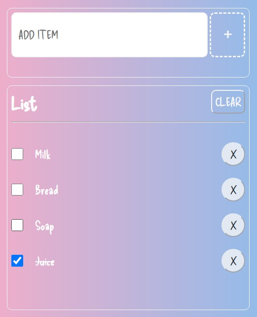

# List Application

Simple **To Do List** application written in full Typescript.

## Available Scripts 

In the project directory, you can run:

#### `npm run dev`

It will run the app in development mode. Open [ http://localhost:5173]( http://localhost:5173/) to view it in your browser.

## Screenshots :camera:

